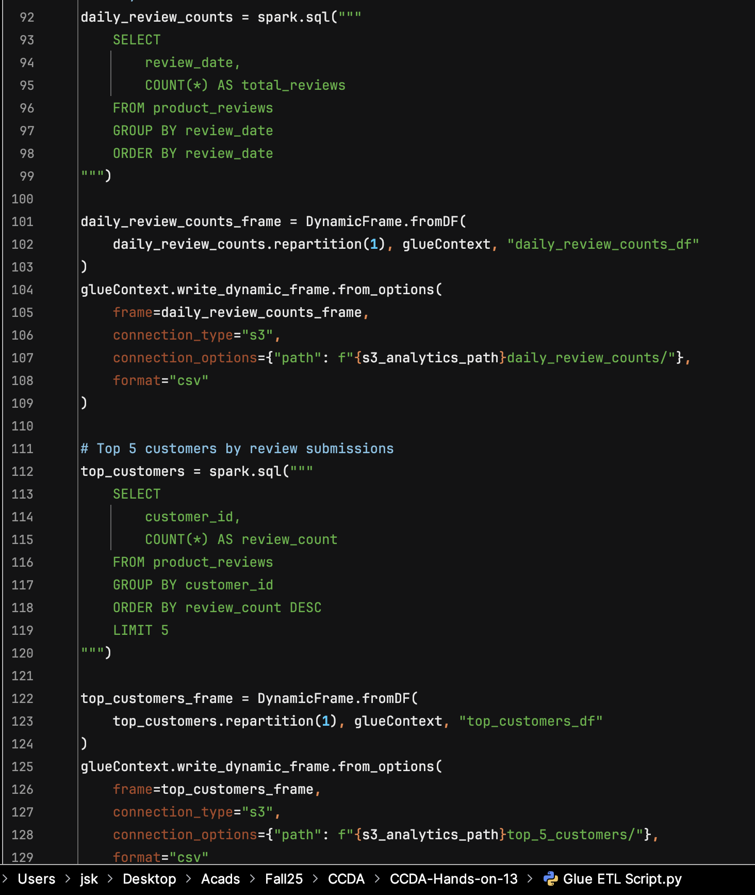
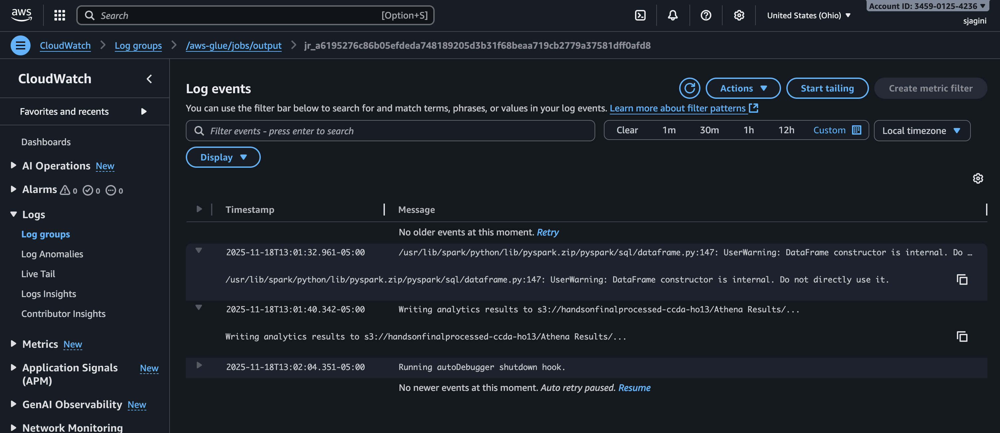

# Serverless Spark ETL Pipeline (Hands-on 13)

This repository captures my CCDA Hands-on 13 solution: an automated, event-driven analytics pipeline that turns raw `reviews.csv` uploads into multiple ready-to-query aggregates with zero manual intervention.

---

## Project Snapshot
- **Landing bucket:** `handsonfinallanding-ccda-ho13`
- **Processed/results bucket:** `handsonfinalprocessed-ccda-ho13`
- **Trigger:** S3 upload of `reviews.csv`
- **Compute:** AWS Lambda + AWS Glue (Spark)
- **Outputs:** Clean parquet/csv tables plus analytics stored locally in `results/` (mirrors what is written to `s3://handsonfinalprocessed-ccda-ho13/Athena Results/`).

---

## Architecture & Flow
1. Upload `reviews.csv` to the landing bucket. The sample file in this repo matches the schema used throughout.
2. An S3 event triggers `lambda function.py`, which simply calls `start_job_run` for the Glue job `process_reviews_job`.
3. `Glue ETL Script.py` (PySpark) reads the landing bucket, cleans the dataset, and materializes four analytics queries.
4. All cleaned data and query outputs are saved in `handsonfinalprocessed-ccda-ho13`, and copied locally under `results/` for quick inspection.

---

## Implementation Approach
- **Data cleansing:** cast `rating`, convert `review_date`, fill nulls, normalize `product_id` casing, and persist the curated dataset to `processed-data/`.
- **Analytics layer:** Spark SQL queries drive re-usable aggregates. Screenshots below (taken in VS Code—download/open in VS Code if your Markdown viewer hides images) show the exact query definitions captured in the Glue script.

### Query outputs
Each query writes to both S3 and the mirrored `results/` directory so we can share artifacts directly from this repo:
- `results/avg-rating/` – Average rating + review count per product (sorted by average rating).
- `results/daily-review/` – Daily review counts, useful for detecting activity spikes.
- `results/top-5-customers/` – Top five customers by number of reviews (identifies power users).
- `results/rating-distribution/` – Histogram of star ratings for sentiment tracking.

---

## Monitoring & Validation
CloudWatch logs confirm that the Glue job ran successfully and wrote analytics back to `s3://handsonfinalprocessed-ccda-ho13/Athena Results/`.

---

## How to Reproduce
1. Provision the IAM role, Glue job, and Lambda function as described in the source files (Glue job name `process_reviews_job`).
2. Upload `reviews.csv` to `handsonfinallanding-ccda-ho13`.
3. Monitor the CloudWatch log group `/aws-glue/jobs/output` to verify the run (screenshot above).
4. Query the generated Parquet/CSV results directly from `results/` or the matching `Athena Results/` prefixes in the processed bucket.

---

## Cleanup Checklist
To avoid extra costs, delete the landing/processed buckets, Lambda function, Glue job, and the `AWSGlueServiceRole-Reviews` role once you finish testing.
